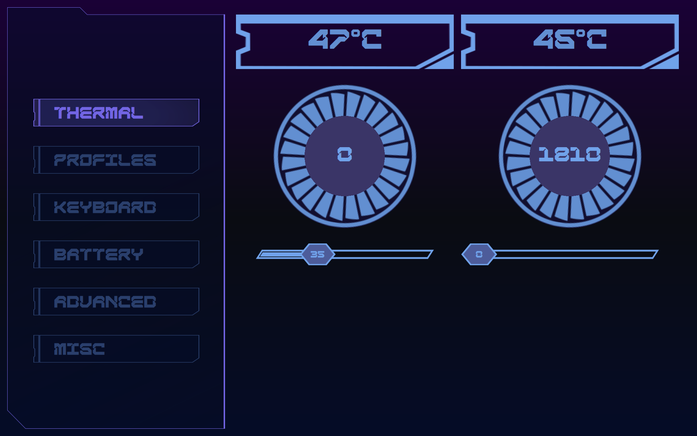

# PredatorBlue

Cyberpunk themed Linux System Monitor Application for Acer Predator Laptops



## Requirements

[Linuwu-Sense Kernel Module](https://github.com/0x7375646F/Linuwu-Sense)

## Features

- Fan Control (CPU and GPU)

## Build

```
git clone https://github.com/bluebottlewize/predator-blue
cd predator-blue
mkdir build
cd build
cmake ..
cmake --build .
sudo ./appPredatorBlue
```

## Todo

- [ ] Support all features in Linuwu-Sense Module
- [ ] Add system monitoring capabilities

### Special thanks to [0x7375646F](https://github.com/0x7375646F/Linuwu-Sense) for the Linuwu-Sense Kernel Module
